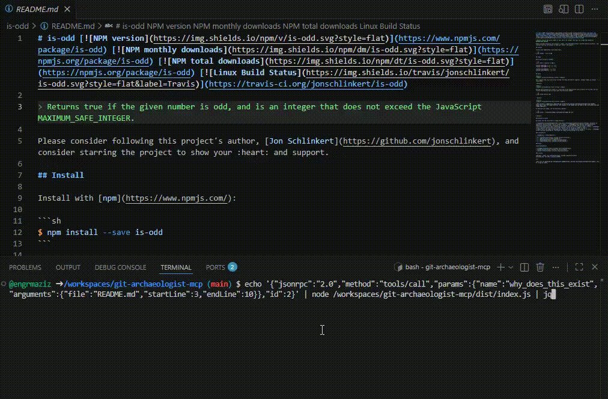

## Install

```json
{
  "mcpServers": {
    "git-archaeologist": {
      "command": "npx",
      "args": ["-y", "git-archaeologist-mcp"],
      "env": {
        "GITHUB_TOKEN": "your_github_token",
        "REPO_PATH": "/absolute/path/to/your/repo"
      }
    }
  }
}
```

Add this to your Claude Desktop, Cursor, or Continue MCP config.

## How it works

1. `git blame` identifies the commits behind a line range.
2. Each commit is resolved to its GitHub PR via the API.
3. PR text is parsed for linked issues (`fixes #N`).
4. Results are cached in SQLite to respect API rate limits.



## License

MIT
